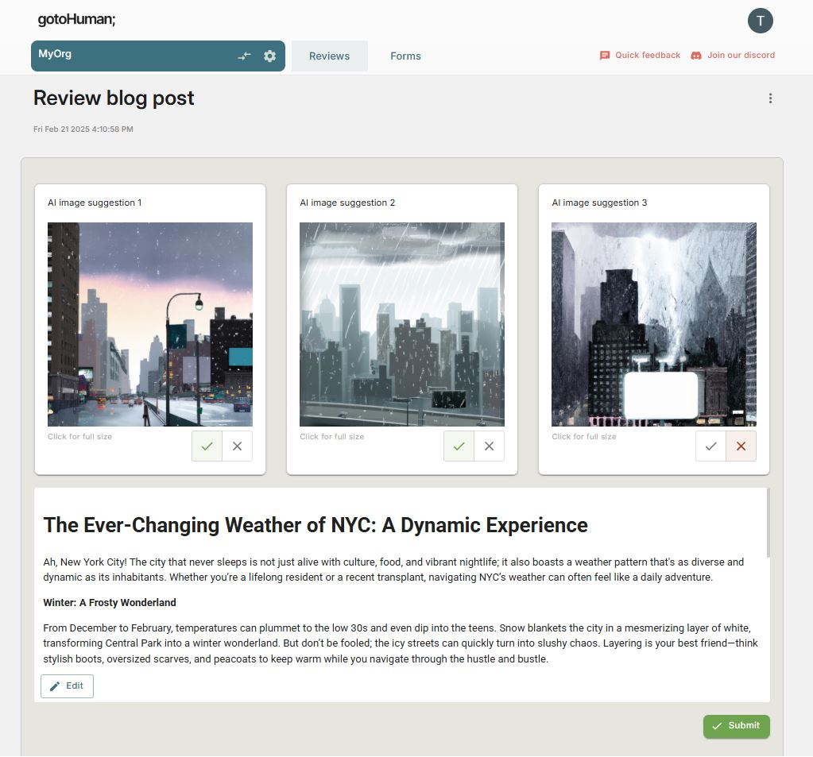

# gotoHuman | LangChain | MCP

An AI agent demonstrating the use of Anthropic's [Model Context Protocol (MCP)](https://modelcontextprotocol.io/introduction) and LangChain's [MCP Adapters](https://github.com/langchain-ai/langchain-mcp-adapters) and [gotoHuman](https://gotohuman.com) for human approvals.

## Agent

#### MCP Servers
- Content writer
- Image generator
- Human review requester (gotoHuman)

#### MCP CLient
- Using `MultiServerMCPClient` to connect to multiple MCP servers and use their tools

## Requirements

- [gotoHuman](https://app.gotohuman.com) API key
- A review form in gotoHuman (Import `sgL6V7hFFIeSBIfqlISA`)
- [OpenAI](https://platform.openai.com/api-keys) API key

## Setup

1. Install the required packages:
   ```
   pip install -r requirements.txt
   ```

2. Set up your environment variables in a `.env` file:
   ```
   GOTOHUMAN_API_KEY=xxx
   GOTOHUMAN_FORM_ID=xxx
   OPENAI_API_KEY=sk-xxx
   ```

## Usage

Run the script:

```
python main.py
```

Approve the blog post in your [gotoHuman](https://app.gotohuman.com) inbox:
