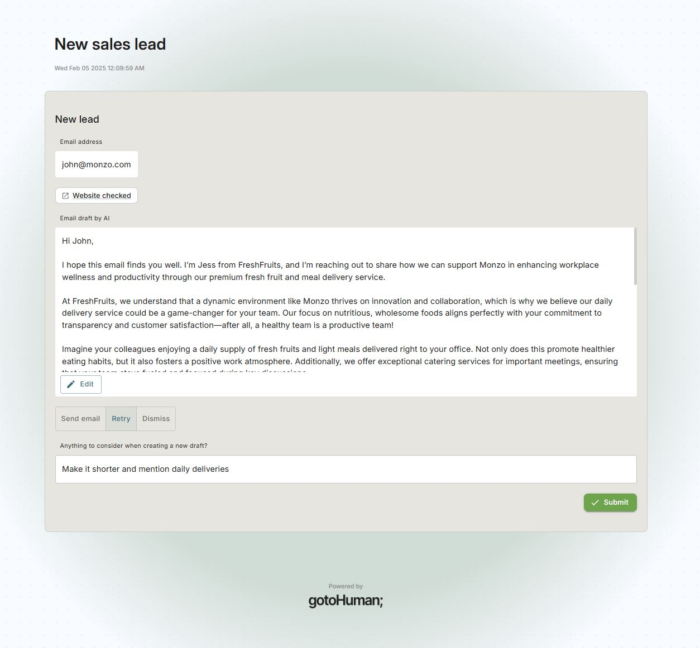

# gotoHuman | LangGraph | Firecrawl

An AI agent built with [LangGraph](https://langchain-ai.github.io/langgraph/) integrating [gotoHuman](https://gotohuman.com) to keep a **human in the loop**.  
This agent gets triggered with an email address of a new sales lead, scrapes their website with [Firecrawl](https://firecrawl.dev/) and drafts a personalized email outreach. You'll receive the draft in your [gotoHuman](https://gotohuman.com) inbox, where you can edit and approve it or sent it back to the agent with feedback.

## Setup

1. Install the required packages:
   ```bash
   pip install gotohuman langgraph langgraph-checkpoint-postgres langchain_openai "fastapi[standard]" firecrawl-py
   # Depending on your Postgres, you might also need: pip install psycopg[binary]
   ```

2. Rename the `example.env` file to `.env` and enter the environment variables:
    - [OpenAI](https://platform.openai.com/api-keys) API key
    - [gotoHuman](https://app.gotohuman.com) API key
    - ID of a review form in gotoHuman (Import `OmmAnhbnWmird3oz60q2`)
    - [Firecrawl](https://firecrawl.dev/) API key
    - A Postgres DB url, e.g. at [Neon](https://neon.tech/)

## Run locally

Run FastAPI server:

```bash
fastapi dev main.py
```

Use ngrok to turn it into a public endpoint:
```bash
ngrok http http://127.0.0.1:8000

# https://xxxx-xxxx.ngrok-free.app
```

Enter the ngrok URL as the webhook in your gotoHuman form.

## Trigger it

Trigger the agent with an email address.

#### Manually in gotoHuman
Create a new **trigger form** with a text input field with ID `email` and include the same webhook as above. You'll see a trigger button appear in gotoHuman.

#### Via API
`HTTP POST [local or ngrok URL]`
```json
{
  "email": "mike@timhortons.com"
}
```

## Human feedback

Approve the email in your [gotoHuman](https://app.gotohuman.com) inbox:  

